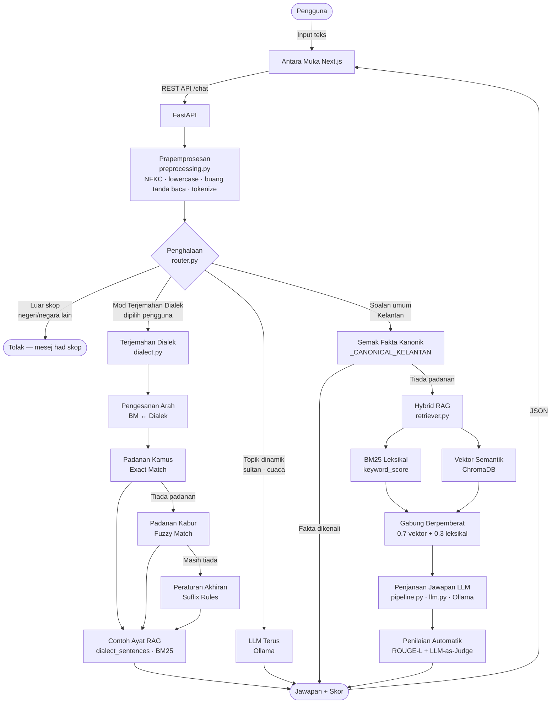

# BAB IV: PEMBANGUNAN DAN PENGUJIAN SISTEM

> **Dokumen D6 — IMPLEMENTASI (Proses Pembangunan)**
> Projek: JomKecek — Chatbot Dialek dan Pengetahuan Kelantan Berasaskan *Hybrid RAG*
> Nama: Mas Arifah binti Mahrizan (A203335)
> Penyelia: Dr. Fadhilah binti Rosdi
> Fakulti Teknologi dan Sains Maklumat (FTSM), Universiti Kebangsaan Malaysia (UKM)

---

## 4.1 PENGENALAN

### 4.1.1 Tujuan Dokumen

Dokumen Implementasi (D6) ini bertujuan untuk menghuraikan secara terperinci proses pembangunan sebenar sistem JomKecek, iaitu sebuah *chatbot* pintar yang menyokong terjemahan dialek Kelantan secara dwiarah antara Bahasa Melayu standard dan dialek Kelantan, serta menyampaikan maklumat tempatan berkaitan pelancongan, makanan tradisional, budaya dan pengetahuan am negeri Kelantan. Dokumen ini menjelaskan bagaimana spesifikasi reka bentuk yang telah dirangka sebelum ini diterjemahkan kepada kod sumber yang berfungsi, dengan memberikan tumpuan kepada segmen-segmen kod yang kritikal, inovatif dan signifikan dari sudut teknikal. Selaras dengan garis panduan D6, dokumen ini tidak memaparkan keseluruhan kod sistem, sebaliknya memilih dan menghuraikan bahagian-bahagian kod yang paling penting bagi memahami cara sistem ini dibina dan berfungsi secara menyeluruh.

### 4.1.2 Skop Dokumen

Skop dokumen ini merangkumi keseluruhan proses pembangunan sistem JomKecek bermula daripada peringkat penyediaan persekitaran sehinggalah ke peringkat penyepaduan antara muka pengguna. Secara spesifik, dokumen ini membincangkan sebelas aspek pembangunan utama, iaitu: (1) penyediaan persekitaran dan teknologi pembangunan; (2) penyediaan serta pemuatan set data daripada fail Excel; (3) pembangunan modul prapemprosesan teks dwibahasa; (4) pembinaan pangkalan data vektor menggunakan ChromaDB; (5) pembangunan modul penghalaan pertanyaan (*query routing*); (6) pembangunan modul terjemahan dialek; (7) pembangunan mekanisme capaian *Hybrid Retrieval-Augmented Generation* (RAG); (8) pembangunan modul orkestrasi dan penjanaan jawapan oleh Model Bahasa Besar (LLM); (9) pembangunan modul penilaian automatik berasaskan ROUGE-L dan *LLM-as-Judge*; (10) pembangunan antara muka pengaturcaraan aplikasi (API) bahagian belakang; serta (11) pembangunan antara muka pengguna (*front end*) berasaskan Next.js. Perlu ditegaskan bahawa dokumen ini memberikan tumpuan kepada aspek pembangunan dan implementasi semata-mata, manakala bahagian pengujian dan penilaian prestasi sistem dibincangkan secara berasingan dalam dokumen yang berkenaan.

### 4.1.3 Kaitan dengan Dokumen Lain

Dokumen D6 ini merupakan kesinambungan langsung daripada dua dokumen terdahulu dalam kitaran pembangunan sistem. Dokumen D3 (Keperluan) telah mentakrifkan keperluan fungsian seperti terjemahan dialek, soal jawab maklumat Kelantan dan penilaian jawapan, serta keperluan bukan fungsian seperti ketepatan, masa tindak balas dan antara muka mesra pengguna. Dokumen D4 (Reka Bentuk) pula telah mentakrifkan seni bina sistem, carta alir proses, reka bentuk pangkalan pengetahuan serta reka bentuk antara muka pengguna. Berdasarkan landasan yang telah ditetapkan oleh kedua-dua dokumen tersebut, Dokumen D6 ini merealisasikan reka bentuk D4 menjadi modul-modul perisian, pangkalan data vektor dan antara muka sebenar, seterusnya melaksanakan setiap keperluan yang ditakrifkan dalam D3 ke dalam bentuk kod yang berfungsi. Secara ringkasnya, D3 menentukan *apa* yang perlu dibina, D4 menentukan *bagaimana* ia direka, dan D6 menghasilkan *sistem sebenar* yang berfungsi.

Satu perkara penting yang perlu dimaklumkan ialah perubahan teknologi yang berlaku semasa fasa pembangunan. Dalam dokumen usulan (D5) terdahulu, sistem ini dirancang menggunakan kerangka Streamlit. Namun sepanjang fasa pembangunan, seni bina sistem telah dimigrasikan kepada gabungan Next.js 14 (bahagian hadapan) dan FastAPI (bahagian belakang) bagi mendapatkan pengasingan yang lebih jelas antara antara muka pengguna dan logik perniagaan, prestasi yang lebih baik, serta kawalan reka bentuk antara muka yang lebih fleksibel. Dokumen D6 ini dengan demikian menerangkan sistem sebenar yang telah dibangunkan, iaitu seni bina Next.js + FastAPI.

### 4.1.4 Istilah dan Akronim

| Istilah / Akronim | Maksud |
|---|---|
| **RAG** | *Retrieval-Augmented Generation* — teknik menggabungkan capaian maklumat dengan penjanaan jawapan oleh LLM supaya jawapan berasaskan fakta sebenar. |
| **Hybrid RAG** | Capaian gabungan yang menggabungkan kaedah leksikal (BM25) dan kaedah vektor (semantik) untuk mendapatkan dokumen yang paling relevan. |
| **LLM** | *Large Language Model* (Model Bahasa Besar) — model AI yang menjana teks bahasa tabii. |
| **BM25** | *Best Matching 25* — algoritma pemarkahan leksikal berasaskan kekerapan perkataan (TF-IDF). |
| **Embedding** | Perwakilan vektor berangka bagi teks yang menangkap makna semantik. |
| **ChromaDB** | Pangkalan data vektor sumber terbuka untuk menyimpan dan mencari *embedding*. |
| **Ollama** | Perisian untuk menjalankan model LLM secara setempat (*local hosting*). |
| **LLM-as-Judge** | Kaedah penilaian di mana sebuah LLM menilai kualiti jawapan yang dijana oleh sistem. |
| **ROUGE-L** | Metrik yang mengukur pertindihan jujukan terpanjang (*Longest Common Subsequence*) antara jawapan dengan konteks. |
| **API** | *Application Programming Interface* — antara muka komunikasi antara bahagian hadapan dengan bahagian belakang. |
| **Canonical fact** | Fakta tetap dan disahkan tentang Kelantan yang dikodkan secara langsung bagi mengelakkan halusinasi LLM. |
| **GGUF** | Format fail model terkuantisasi yang digunakan oleh Ollama untuk model setempat. |

---

## 4.2 PROSES PEMBANGUNAN

Bahagian ini menerangkan proses pembangunan sistem JomKecek mengikut urutan logik pembinaan, bermula daripada penyediaan persekitaran sehinggalah ke pembinaan antara muka pengguna. Bagi setiap modul, penerangan diberikan diikuti dengan paparan segmen kod kritikal (Rajah) serta huraian yang menonjolkan bahagian-bahagian penting kod tersebut.

**Rajah 4.0: Gambaran keseluruhan aliran sistem JomKecek**



### 4.2.1 Persekitaran dan Teknologi Pembangunan

Sistem JomKecek dibangunkan menggunakan seni bina dua lapisan terpisah (*decoupled architecture*) yang terdiri daripada bahagian hadapan dan bahagian belakang yang berkomunikasi melalui panggilan REST API. Bahagian hadapan dibangunkan menggunakan Next.js 14, React 18 dan TypeScript bagi membolehkan pembinaan antara muka yang responsif, moden dan mudah diselenggara. Bahagian belakang pula menggunakan FastAPI dengan Python 3.12, iaitu kerangka API berprestasi tinggi yang menyediakan pengesahan data secara automatik. Bagi komponen LLM, model Malaysian-Qwen2.5-7B-Instruct (Q4\_K\_M) digunakan sebagai model utama melalui Ollama kerana ia dilatih khusus untuk konteks bahasa Malaysia dan dijalankan secara setempat demi memelihara privasi data pengguna. Model qwen2.5:7b pula berfungsi sebagai LLM penilai dalam mekanisme *LLM-as-Judge*. Pangkalan data vektor menggunakan ChromaDB manakala model *embedding* yang dipilih ialah `sentence-transformers/paraphrase-multilingual-MiniLM-L12-v2`, iaitu model berbilang bahasa yang menyokong Bahasa Melayu.

Konfigurasi terpusat bagi keseluruhan sistem disimpan dalam fail `jomkecek/config.py`, yang membenarkan setiap parameter penting diubah melalui pemboleh ubah persekitaran (*environment variables*) tanpa mengubah kod sumber.

**Rajah 4.1: Konfigurasi terpusat sistem (`jomkecek/config.py`)**

```python
OLLAMA_URL = os.getenv("OLLAMA_URL", "http://127.0.0.1:11434")
MODEL_NAME = os.getenv("JOMKECEK_MODEL", "qwen2.5:7b")
JUDGE_MODEL_NAME = os.getenv("JOMKECEK_JUDGE_MODEL", "qwen2.5:7b")

USE_CHROMA = os.getenv("JOMKECEK_USE_CHROMA", "1") == "1"
CHROMA_PATH = os.getenv("JOMKECEK_CHROMA_PATH", "./chroma_db_jomkecek")
EMBED_MODEL = os.getenv("JOMKECEK_EMBED_MODEL",
    "sentence-transformers/paraphrase-multilingual-MiniLM-L12-v2")

LOW_TRANSLATION_CONFIDENCE = 0.35   # ambang keyakinan minimum terjemahan
LOW_RETRIEVAL_CONFIDENCE = 0.28     # ambang keyakinan minimum capaian RAG
DEFAULT_TOP_K = 6                   # bilangan dokumen teratas yang dicapai

COLLECTIONS = {
    "dialect_words":     {"perkataan"},
    "dialect_sentences": {"contoh_ayat"},
    "tourism":           {"tempat_menarik"},
    "food":              {"makanan_tradisional"},
    "culture":           {"budaya"},
}
```

Pendekatan konfigurasi terpusat ini merupakan amalan kejuruteraan perisian yang baik dan melambangkan reka bentuk sistem yang terancang. Penggunaan fungsi `os.getenv()` membenarkan setiap nilai seperti nama model atau ambang keyakinan ditetapkan secara lalai tetapi boleh ditindih melalui pemboleh ubah persekitaran tanpa memerlukan sebarang pengubahsuaian pada kod sumber. Pemetaan `COLLECTIONS` menghubungkan setiap helaian dalam fail Excel kepada koleksi logik dalam sistem, contohnya helaian `perkataan` dipetakan kepada koleksi `dialect_words`. Dua pemalar ambang, iaitu `LOW_TRANSLATION_CONFIDENCE` bernilai 0.35 dan `LOW_RETRIEVAL_CONFIDENCE` bernilai 0.28, berfungsi sebagai mekanisme kawalan kualiti yang kritikal: sekiranya keyakinan terjemahan atau capaian jatuh di bawah nilai ambang ini, sistem akan memberikan respons yang berhati-hati dan tidak meneka jawapan secara sewenang-wenangnya.

### 4.2.2 Penyediaan dan Pemuatan Set Data

Pangkalan pengetahuan JomKecek disimpan dalam sebuah fail Excel bernama `DATA_JOMKECEK_CLEANED copy.xlsx` yang mengandungi lima helaian utama, iaitu `perkataan` (perbendaharaan kata dialek), `contoh_ayat` (ayat contoh dialek), `tempat_menarik` (tempat pelancongan), `makanan_tradisional` (makanan tradisional) dan `budaya` (warisan budaya). Modul `jomkecek/data.py` bertanggungjawab memuatkan kesemua helaian ini dan menukarkan setiap baris kepada objek dokumen RAG yang seragam bagi memudahkan pemprosesan selanjutnya oleh subsistem-subsistem lain.

**Rajah 4.2: Pemuatan set data daripada Excel (`jomkecek/data.py`)**

```python
@lru_cache(maxsize=1)
def load_documents() -> list[RagDocument]:
    path = active_data_path()
    docs: list[RagDocument] = []
    xls = pd.ExcelFile(path)
    for sheet in xls.sheet_names:                  # setiap helaian Excel
        df = pd.read_excel(path, sheet_name=sheet)
        for i, row in df.iterrows():               # setiap baris data
            doc = _row_to_doc(row, sheet.lower(), i + 1)
            if doc:
                docs.append(doc)
    return docs
```

Fungsi `load_documents()` membaca setiap helaian Excel dan menukarkan setiap baris menjadi objek `RagDocument`. Aspek yang paling signifikan dalam implementasi fungsi ini ialah penggunaan penghias (*decorator*) `@lru_cache(maxsize=1)` yang menyimpan hasil pemuatan dalam ingatan (*cache*) supaya fail Excel hanya dibaca **sekali sahaja** sepanjang hayat aplikasi. Mekanisme *caching* ini meningkatkan prestasi sistem dengan ketara kerana setiap permintaan pengguna yang seterusnya tidak perlu membaca semula fail daripada cakera, seterusnya mengurangkan latensi tindak balas. Setiap baris data ditukar kepada struktur data seragam `RagDocument` yang ditakrifkan dalam `models.py` dan mengandungi medan-medan seperti `text`, `category`, `title`, `row`, `collection` dan `metadata`, memastikan konsistensi representasi data merentas keseluruhan sistem.

### 4.2.3 Modul Prapemprosesan Teks

Sebelum sebarang carian atau terjemahan dilakukan, teks input pengguna perlu dinormalkan terlebih dahulu bagi memastikan ketepatan pemprosesan. Setiap pertanyaan yang diterima akan melalui proses penukaran ke huruf kecil, penyeragaman aksara Unicode, pembuangan tanda baca, pembuangan ruang berlebihan dan tokenisasi ringkas bagi memastikan input pengguna berada dalam bentuk yang konsisten. Bagi pertanyaan dalam mod terjemahan, input yang telah dipraproses seterusnya melalui proses pengesanan bahasa, manakala pertanyaan dalam mod pelancongan akan terus diproses ke peringkat capaian RAG.

**Rajah 4.3: Penormalan teks (`jomkecek/preprocessing.py`)**

```python
import re
import unicodedata

def normalize_text(text: str) -> str:
    text = unicodedata.normalize("NFKC", str(text))   # seragamkan aksara Unicode
    text = text.lower()
    text = re.sub(r"[^\w\s']", " ", text, flags=re.UNICODE)
    text = re.sub(r"\s+", " ", text).strip()
    return text

def tokenize(text: str) -> list[str]:
    return re.findall(r"[\w']+", normalize_text(text), flags=re.UNICODE)
```

Fungsi `normalize_text()` menjalankan empat langkah pembersihan secara berurutan. Langkah pertama ialah penormalan Unicode menggunakan `unicodedata.normalize("NFKC", ...)` yang menyeragamkan aksara yang kelihatan sama tetapi berbeza secara dalaman, seperti aksara yang disalin daripada aplikasi pemesejan yang kadangkala membawa aksara *zero-width space* atau aksara tanda baca yang berbeza bentuk kodnya. Ini memastikan teks yang diproses benar-benar seragam tanpa mengira sumber input pengguna. Langkah kedua menukar keseluruhan teks kepada huruf kecil bagi menghapuskan perbezaan huruf besar dan kecil semasa proses padanan. Langkah ketiga membuang semua tanda baca dan simbol melalui `re.sub(r"[^\w\s']", " ", ...)`, dengan apostrophe dikecualikan kerana ia sebahagian daripada sesetengah bentuk penulisan. Langkah keempat mengempis semua ruang berganda kepada satu ruang melalui `re.sub(r"\s+", " ", ...)` sebelum membuang ruang di kedua-dua hujung teks. Pendekatan ini tidak menggunakan kamus penggantian perkataan kerana sistem menyediakan panduan kepada pengguna untuk menggunakan Bahasa Melayu standard, menjadikan penormalan automatik berasaskan kamus tidak diperlukan. Fungsi `tokenize()` pula memecahkan teks yang telah dinormalkan kepada senarai token yang menjadi asas kepada pemarkahan BM25 dan pengesanan dialek dalam modul-modul yang seterusnya.

### 4.2.4 Pembinaan Pangkalan Data Vektor ChromaDB

Bagi membolehkan carian semantik yang berasaskan makna dan bukan hanya padanan perkataan secara leksikal, setiap dokumen dalam koleksi `tempat_menarik`, `makanan_tradisional` dan `budaya` perlu ditukar kepada *embedding* vektor dan disimpan dalam ChromaDB. Proses pengindeksan ini dijalankan sekali sahaja melalui skrip `setup_chroma.py` sebelum aplikasi dimulakan buat pertama kalinya, dan hasil pengindeksan disimpan secara berterusan dalam cakera untuk penggunaan semula pada sesi-sesi berikutnya.

**Rajah 4.4: Pengindeksan dokumen ke ChromaDB (`setup_chroma.py`)**

```python
embed_fn = ef.SentenceTransformerEmbeddingFunction(model_name=EMBED_MODEL)
client = chromadb.PersistentClient(path=CHROMA_PATH)

for collection_name, collection_docs in by_collection.items():
    client.delete_collection(collection_name)        # bina semula dari awal
    col = client.create_collection(collection_name,
                                   embedding_function=embed_fn)
    for i in range(0, len(collection_docs), BATCH_SIZE):
        batch = collection_docs[i : i + BATCH_SIZE]
        texts = [f"{doc.title} {doc.text}" for doc in batch]
        ids   = [f"{doc.collection}:{doc.row}" for doc in batch]
        col.add(ids=ids, documents=texts)            # ChromaDB jana embedding
```

Skrip ini membina tiga koleksi vektor yang berasingan untuk domain pelancongan, makanan dan budaya. Aspek yang paling signifikan dalam implementasi ini terdiri daripada tiga perkara. Pertama, penggunaan `SentenceTransformerEmbeddingFunction` dengan model berbilang bahasa yang secara automatik menukar teks Bahasa Melayu kepada vektor dimensi tinggi apabila dokumen ditambahkan ke dalam koleksi. Kedua, pemprosesan secara kelompok (*batch processing*) dengan saiz 128 dokumen pada satu masa bagi mengelakkan beban ingatan yang berlebihan semasa proses pengindeksan. Ketiga, setiap dokumen diberi pengecam unik dalam format `koleksi:nombor_baris` seperti `food:42`, yang membolehkan dokumen dipadankan semula dengan data asalnya dalam fail Excel semasa proses capaian. Secara keseluruhannya, ChromaDB mengendalikan penjanaan *embedding* secara dalaman, justeru pembangun hanya perlu menyediakan teks mentah tanpa perlu menguruskan proses penjanaan vektor secara manual.

Perlu dijelaskan bahawa dua koleksi lain dalam set data, iaitu `dialect_words` (helaian `perkataan`) dan `dialect_sentences` (helaian `contoh_ayat`), tidak dimasukkan ke dalam ChromaDB secara reka bentuk yang disengajakan. Koleksi `dialect_words` mengandungi pasangan perkataan dialek-BM yang memerlukan padanan tepat (*exact match*) atau padanan kabur (*fuzzy match*) pada peringkat perkataan tunggal — carian semantik berasaskan vektor tidak sesuai untuk tugasan ini kerana makna semantik dua perkataan yang hampir sama belum tentu memberikan terjemahan yang betul. Koleksi `dialect_sentences` pula dicapai melalui pemarkahan BM25 leksikal semata-mata semasa proses pengambilan contoh ayat bagi sokongan terjemahan, dan ini mencukupi kerana padanan yang diperlukan adalah berdasarkan token perkataan dialek yang dikesan, bukan persamaan makna secara menyeluruh. Pemisahan ini memastikan setiap koleksi diproses menggunakan kaedah capaian yang paling sesuai mengikut sifat datanya.

### 4.2.5 Modul Penghalaan Pertanyaan

Setiap pertanyaan pengguna perlu dihalakan ke laluan pemprosesan yang tepat sama ada terjemahan dialek, soal jawab maklumat Kelantan, ataupun pengetahuan dinamik LLM. Modul `jomkecek/router.py` bertanggungjawab mengenal pasti niat (*intent*) pengguna dan menentukan laluan pemprosesan yang paling sesuai berdasarkan analisis kandungan pertanyaan tersebut.

**Rajah 4.5: Logik penghalaan pertanyaan (`jomkecek/router.py`)**

```python
def route_query(query: str, selected_mode: str = "Terjemahan Dialek") -> dict:
    normalized = normalize_query(query)
    token_set = set(tokenize(normalized))

    # 1) Tapisan luar skop — tolak pertanyaan negeri/negara lain
    if detect_out_of_scope(normalized):
        return {"mode": "out_of_scope", "intent": "out_of_scope", ...}

    # 2) Mod terjemahan — terus ke pipeline terjemahan
    if selected_mode == "Terjemahan Dialek":
        return {"mode": "dialect_translation", "intent": "dialect", ...}

    # 3) Mod pelancongan — topik dinamik terus ke LLM
    if _is_dynamic_topic(token_set):
        return {"mode": "llm_knowledge", "intent": "dynamic", ...}

    # 4) Mod pelancongan — soal jawab umum melalui RAG
    intent, collections = _intent_and_collections(normalized)
    return {"mode": "general_qa", "intent": intent, ...}
```

Fungsi `route_query()` merupakan komponen pengarah utama sistem yang menentukan aliran pemprosesan berdasarkan mod yang dipilih pengguna secara eksplisit melalui butang antara muka. Sistem menyediakan dua mod yang berbeza skop sepenuhnya — *Terjemahan Dialek* dan *Pelancongan* — dan setiap mod mempunyai laluan pemprosesan tersendiri yang berasingan.

Langkah pertama yang dijalankan untuk kedua-dua mod ialah tapisan luar skop melalui `detect_out_of_scope()`, yang menolak pertanyaan berkaitan negeri atau negara lain tanpa kaitan dengan Kelantan. Bagi mod *Terjemahan Dialek*, pertanyaan yang lulus tapisan terus dihalakan ke modul terjemahan. Bagi mod *Pelancongan* pula, router mengenal pasti niat pertanyaan melalui `_intent_and_collections()` untuk menentukan koleksi dataset yang perlu dicari — sama ada `tourism`, `food` atau `culture`. Topik dinamik seperti *sultan*, *cuaca* dan *politik* dihalakan terus ke LLM kerana maklumat sedemikian berubah mengikut masa dan tidak sesuai disimpan dalam dataset yang statik. Bagi pertanyaan lain, sistem menggunakan mekanisme RAG dan jatuh semula kepada LLM sekiranya capaian dataset lemah atau tiada hasil yang relevan ditemui.

### 4.2.6 Modul Terjemahan Dialek

Modul terjemahan dalam `jomkecek/dialect.py` dan `jomkecek/pipeline.py` melaksanakan terjemahan dwiarah melalui empat peringkat berurutan: (1) pengesanan arah bahasa, (2) padanan perkataan, (3) capaian contoh ayat RAG, dan (4) penjanaan terjemahan natural oleh LLM.

**Rajah 4.6: Peringkat 1 — Pengesanan arah bahasa (`jomkecek/dialect.py`)**

```python
def detect_language_mode(clean_query: str) -> str:
    d = _dialect_dict()          # kamus dialek -> BM (dari Excel)
    b = _bm_to_dialect()         # kamus BM -> dialek (dari Excel)
    tokens = tokenize(clean_query)
    dialect_hits = sum(1 for t in tokens if t in d or t in _KELANTAN_TO_BM_CORE)
    bm_hits      = sum(1 for t in tokens if t in b or t in _BM_TO_KELANTAN_CORE)

    if bm_hits > dialect_hits:        return "bm"        # arah: BM -> dialek
    if dialect_hits and bm_hits:      return "mixed"
    if dialect_hits:                  return "dialect"   # arah: dialek -> BM
    if bm_hits:                       return "bm"
    return "unknown"
```

Fungsi ini menentukan arah terjemahan secara automatik dengan mengira token yang dikenali dalam dua kamus — kamus dialek-ke-BM dan kamus BM-ke-dialek — kemudian membandingkan kiraan tersebut. Dua sumber rujukan digabungkan: kamus daripada Excel dan kamus teras yang dikodkan terus (`_KELANTAN_TO_BM_CORE`) bagi menangani perkataan asas seperti *ambo*, *mu* dan *dio* yang sering tersalah terjemah dalam Excel.

**Rajah 4.7: Peringkat 2 — Padanan perkataan (exact → fuzzy → akhiran) (`jomkecek/dialect.py`)**

```python
SUFFIX_RULES: list[tuple[str, str]] = [
    ("ang", "e"),    # contoh: "orang" -> "ore"
    ("at", "ak"),    # contoh: "cepat" -> "cepak"
    ("as", "ah"),    # contoh: "panas" -> "panah"
    ("an", "e"),     # contoh: "makan" -> "make"
    ("a",  "o"),     # contoh: "apa"  -> "apo"
    # ... disusun dari akhiran paling panjang ke paling pendek
]

def apply_suffix_rule(word: str) -> str | None:
    for suffix, replacement in SUFFIX_RULES:
        if word.endswith(suffix) and len(word) > len(suffix):
            return word[: -len(suffix)] + replacement
    return None
```

Setiap token dipadankan melalui tiga lapisan berurutan: padanan tepat (*exact match*) terhadap kamus Excel, padanan kabur (*fuzzy*) untuk variasi ejaan, dan akhiran fonologi (`SUFFIX_RULES`) sebagai jaring terakhir. Susunan `SUFFIX_RULES` daripada akhiran terpanjang ke terpendek adalah kritikal — jika `"a" → "o"` diuji dahulu, *"makan"* akan tersalah transformasi; dengan menguji `"an" → "e"` dahulu, ia betul menjadi *"make"*.

**Rajah 4.8: Peringkat 3 & 4 — Capaian contoh ayat RAG + Penjanaan terjemahan LLM (`jomkecek/pipeline.py`)**

```python
def _llm_translate(query, examples, breakdown, direction) -> str:
    from_lang = "dialek Kelantan" if direction == "dialect_to_bm" else "Bahasa Melayu standard"
    to_lang   = "Bahasa Melayu standard" if direction == "dialect_to_bm" else "dialek Kelantan"

    context_lines = "\n".join(
        f"- {ex['dialek']} → {ex['bm']}"
        for ex in examples if ex.get("dialek") and ex.get("bm")
    )
    word_hints = "\n".join(
        f"- {item['dialect']} → {item['bm']}"
        for item in breakdown
        if item.get("bm") and item.get("confidence", 0) > 0
    )
    prompt = f"""Anda ialah penterjemah dialek Kelantan yang pakar.

Contoh terjemahan dari pangkalan data JomKecek:
{context_lines}

Padanan perkataan:
{word_hints}

Terjemahkan ayat berikut dari {from_lang} kepada {to_lang}:
"{query}"

Berikan HANYA terjemahan sahaja, tanpa penjelasan atau nota tambahan."""

    result = ollama_generate(prompt, temperature=0.1)
    return result.strip().strip('"').strip("'")

# Dalam chatbot_pipeline():
translation = translate_dialect(route["normalized_query"])          # Peringkat 1 & 2
matched_words = [item["dialect"] for item in translation["breakdown"] if item.get("matched")]
rag_examples, rag_hits = _get_dialect_examples(matched_words)      # Peringkat 3: capaian BM25

if rag_examples:                                                    # Peringkat 4: RAG + LLM
    llm_result = _llm_translate(query, rag_examples,
                                translation["breakdown"], translation["direction"])
    if llm_result:
        translation["translation"] = llm_result
        used_llm = True
# fallback: terjemahan kamus dari Peringkat 2 dikekalkan jika tiada contoh ayat
```

Perkataan yang berjaya dipadankan dalam Peringkat 2 digunakan sebagai kata kunci BM25 untuk mencari contoh ayat daripada helaian `contoh_ayat` dalam Excel (`_get_dialect_examples`) — inilah komponen RAG dalam aliran terjemahan. Contoh ayat tersebut bersama padanan perkataan disuntik ke dalam prompt LLM untuk menjana terjemahan yang lebih natural bagi keseluruhan ayat. Suhu ditetapkan 0.1 bagi memastikan output deterministik. Sekiranya tiada contoh ayat dicapai, terjemahan kamus dari Peringkat 2 dikekalkan sebagai *fallback*.

### 4.2.7 Modul Capaian Hibrid RAG

Modul capaian dalam fail `jomkecek/retriever.py` melaksanakan teras inovasi sistem JomKecek, iaitu capaian hibrid yang menggabungkan dua kaedah carian yang berbeza: pemarkahan leksikal BM25 dan carian vektor semantik melalui ChromaDB. Gabungan kedua-dua kaedah ini membolehkan sistem mendapatkan dokumen yang relevan merentas dimensi padanan kata kunci dan persamaan makna secara serentak.

**Rajah 4.9: Penggabungan skor hibrid (`jomkecek/retriever.py`)**

```python
def retrieve(query, top_k=DEFAULT_TOP_K, collections=None):
    collections = collections or collections_for_query(query)
    lexical = _lexical_hits(query, collections, top_k * 2)   # BM25
    chroma  = _chroma_hits(query, collections, top_k * 2)    # vektor

    combined: dict[str, RetrievalHit] = {}
    for hit in lexical:
        key = f"{hit.document.collection}:{hit.document.row}"
        combined[key] = hit
    for hit in chroma:
        key = f"{hit.document.collection}:{hit.document.row}"
        existing = combined.get(key)
        keyword = existing.keyword_score if existing else 0.0
        # gabungan berpemberat: 70% vektor + 30% kata kunci
        score = 0.7 * hit.vector_score + 0.3 * keyword
        combined[key] = RetrievalHit(round(score, 3), hit.document,
                                     keyword, hit.vector_score)

    ranked = sorted(combined.values(), key=lambda h: h.score, reverse=True)
    return [hit for hit in ranked[:top_k]
            if hit.score >= LOW_RETRIEVAL_CONFIDENCE]
```

Fungsi `retrieve()` merupakan jantung mekanisme RAG dalam sistem JomKecek. Aspek yang paling penting ialah formula penggabungan berpemberat `score = 0.7 × vektor + 0.3 × kata_kunci`. Pemberat 0.7 kepada skor vektor ditetapkan kerana domain pelancongan melibatkan pertanyaan berasaskan konsep dan niat — seperti *"tempat menarik"* atau *"makanan sedap"* — yang lebih sesuai ditangani melalui persamaan semantik berbanding padanan kata kunci tepat. Pemberat 0.3 kepada BM25 dikekalkan bagi memastikan nama khas seperti nama tempat dan jajahan tidak terlepas padanan. Tapisan akhir yang mensyaratkan skor melebihi `LOW_RETRIEVAL_CONFIDENCE` (0.28) membuang dokumen kurang relevan, memastikan hanya konteks berkualiti disalurkan kepada LLM.

**Rajah 4.10: Pemarkahan leksikal BM25 (`jomkecek/retriever.py`)**

```python
def keyword_score(query_tokens, doc, df, total) -> float:
    doc_tokens = tokenize(f"{doc.title} {doc.category} {doc.text} "
                          f"{' '.join(doc.metadata.values())}")
    counts = Counter(doc_tokens)
    score = 0.0
    for token in query_tokens:
        if token in counts:
            tf  = 1 + math.log(counts[token])                  # kekerapan istilah
            idf = math.log((total + 1) / (df[token] + 1)) + 1  # songsang dokumen
            score += tf * idf
    # ganjaran tambahan jika daerah/jajahan dokumen disebut dalam pertanyaan
    district = (doc.metadata.get("daerah")
                or doc.metadata.get("asal_jajahan") or "").lower()
    if district and district in " ".join(query_tokens):
        score += 3.0
    return score
```

Fungsi `keyword_score()` melaksanakan formula TF-IDF bergaya BM25 untuk mengira skor relevan secara leksikal. Komponen `tf` menggunakan transformasi logaritma supaya perkataan yang berulang tidak mendominasi skor secara tidak proporsional, manakala `idf` memberi nilai lebih tinggi kepada perkataan yang jarang dalam koleksi kerana ia lebih bermaklumat. Selain itu, ganjaran daerah sebanyak 3.0 mata diberikan sekiranya nama jajahan dalam dokumen disebut dalam pertanyaan — ini merupakan inovasi yang kritikal untuk domain Kelantan.

Kepentingan BM25 dapat dibuktikan secara empirikal melalui perbandingan langsung bagi pertanyaan *"tempat menarik di Tumpat"*. Dengan BM25 (hibrid), sistem mengembalikan enam tempat yang semuanya spesifik kepada jajahan Tumpat — Pengkalan Kubor, Pasar Terapung Pulau Suri, Wat Photivihan, Kampung Nelayan Geting — dengan skor tinggi antara 0.84 hingga 1.0. Tanpa BM25 (vektor sahaja), sistem mengembalikan enam tempat Kelantan yang umum seperti Pusat Kesenian Negeri Kelantan dan Taman Budaya Kelantan, tiada satu pun berkaitan Tumpat, dengan skor rendah antara 0.54 hingga 0.56. Ini menunjukkan bahawa model *embedding* vektor tidak berupaya mengenal pasti nama jajahan sebagai penapis geografi, manakala BM25 menangkap padanan nama khas ini dengan tepat melalui ganjaran daerah.

### 4.2.8 Modul Orkestrasi dan Penjanaan Jawapan

Modul `jomkecek/pipeline.py` merupakan modul orkestrasi utama yang menyelaras keseluruhan aliran pemprosesan daripada pertanyaan pengguna sehinggalah jawapan akhir yang disampaikan. Modul ini juga mengandungi salah satu mekanisme anti-halusinasi yang paling penting dalam keseluruhan sistem.

**Rajah 4.11: Pangkalan fakta kanonik anti-halusinasi (`jomkecek/pipeline.py`)**

```python
_CANONICAL_KELANTAN: dict[str, str] = {
    "ibu negeri": "Ibu negeri Kelantan ialah Kota Bharu.",
    "jajahan": ("Kelantan mempunyai 10 jajahan: Kota Bharu, Pasir Mas, "
                "Tumpat, Pasir Puteh, Bachok, Kuala Krai, Machang, "
                "Tanah Merah, Jeli dan Gua Musang."),
    "serambi mekah": ("Gelaran 'Serambi Mekah' diberikan kepada Kelantan "
                      "kerana negeri ini diiktiraf sebagai pusat pengajian "
                      "Islam yang kukuh di Malaysia."),
    # ... fakta lain (bendera, sempadan, masjid negeri, lapangan terbang)
}

def _check_canonical(query: str) -> str | None:
    q = query.lower()
    # padanan kunci berbilang perkataan didahulukan (lebih spesifik)
    for key in sorted(_CANONICAL_KELANTAN.keys(), key=len, reverse=True):
        if key in q:
            return _CANONICAL_KELANTAN[key]
    return None
```

Mekanisme fakta kanonik ini merupakan penyelesaian langsung kepada masalah utama yang dihadapi oleh model bahasa besar, iaitu halusinasi di mana model menjana fakta yang tidak tepat dengan penuh keyakinan. Bagi soalan-soalan yang melibatkan fakta tetap tentang Kelantan yang telah disahkan kebenarannya, seperti bilangan jajahan atau nama ibu negeri, sistem memintas LLM sepenuhnya dan mengembalikan jawapan yang tepat daripada pangkalan fakta yang telah disahkan. Fungsi `_check_canonical()` menyusun kunci padanan mengikut panjang secara menurun supaya kunci yang lebih spesifik seperti *"serambi mekah"* dipadankan sebelum kunci yang lebih umum. Strategi ini menjamin ketepatan sepenuhnya untuk fakta-fakta teras Kelantan tanpa bergantung kepada ramalan LLM yang tidak boleh dipastikan kebenarannya.

**Rajah 4.12: Penjanaan jawapan mengikut jenis (`jomkecek/pipeline.py`)**

```python
def generate_answer_by_type(query, hits, route, answer_type):
    context = retrieval_context(hits)

    if answer_type in {"detail", "reasoning"}:
        detail_prompt = f"""{GENERAL_KELANTAN_PROMPT}
Konteks dari pangkalan data JomKecek:
{context_for_llm}
Soalan: {query}
Arahan:
- Jawab dalam Bahasa Melayu yang natural dan informatif.
- Gunakan maklumat dari konteks di atas sebagai asas jawapan.
- Jangan tambah fakta yang tiada dalam konteks.
"""
        return ollama_generate(detail_prompt, temperature=0.3)
```

Fungsi ini menyesuaikan strategi penjanaan jawapan mengikut jenis soalan yang dikesan, sama ada `direct`, `recommendation`, `detail` mahupun `reasoning`. Aspek yang paling penting ialah struktur *prompt* yang dibina dengan teliti, di mana konteks RAG disuntik ke dalam *prompt* bersama arahan yang tegas supaya LLM tidak menambah fakta yang tidak terdapat dalam konteks yang diberikan. Ini merupakan teknik penjanaan berasaskan konteks (*grounded generation*) yang memastikan jawapan LLM berpaut kepada fakta sebenar daripada pangkalan data, bukan daripada rekaan atau spekulasi model. Nilai suhu (*temperature*) sebanyak 0.3 dipilih khusus untuk soalan terperinci bagi mengimbangi antara kepelbagaian bahasa dengan kestabilan dan ketepatan fakta yang disampaikan.

**Rajah 4.13: *Prompt* sistem dan panggilan Ollama (`jomkecek/llm.py`)**

```python
GENERAL_KELANTAN_PROMPT = """Anda ialah JomKecek, chatbot tempatan Kelantan.
Peraturan WAJIB:
1. Gunakan HANYA maklumat dari konteks RAG yang diberikan.
2. Jika konteks tidak mengandungi jawapan, katakan "Maklumat ini tidak
   tersedia dalam pangkalan data JomKecek."
3. JANGAN reka atau teka fakta — terutama nama tempat, nama masjid,
   nama lapangan terbang, nama jalan, atau angka statistik.
4. JANGAN confuse Kelantan dengan negeri lain.
5. Jawab dalam Bahasa Melayu, ringkas dan berdasarkan konteks sahaja.
"""

def ollama_generate(prompt, temperature=0.2, timeout=120, model=None):
    payload = {
        "model": model or MODEL_NAME,
        "messages": [{"role": "user", "content": prompt}],
        "stream": False,
        "options": {"temperature": temperature, "num_ctx": 4096},
    }
    response = requests.post(f"{OLLAMA_URL}/api/chat", json=payload, timeout=timeout)
    return response.json().get("message", {}).get("content", "").strip()
```

Modul `jomkecek/llm.py` berfungsi sebagai jambatan antara sistem JomKecek dengan model LLM yang dijalankan oleh Ollama. Elemen yang paling penting dalam modul ini ialah `GENERAL_KELANTAN_PROMPT`, iaitu *prompt* sistem yang menetapkan lima peraturan wajib untuk mengawal tingkah laku model secara menyeluruh. Peraturan-peraturan ini berfungsi sebagai had pagar (*guard rail*) pada peringkat *prompt* yang menghalang model daripada mereka fakta sewenang-wenangnya melalui peraturan ketiga, serta menghalang model daripada mengelirukan Kelantan dengan negeri-negeri lain melalui peraturan keempat. Tetapan `num_ctx: 4096` menentukan saiz tetingkap konteks model, manakala nilai suhu lalai sebanyak 0.2 yang rendah memastikan jawapan yang dihasilkan lebih deterministik, konsisten dan kurang terdedah kepada fenomena halusinasi.

### 4.2.9 Modul Penilaian Automatik

Setiap jawapan yang dijana oleh sistem JomKecek dinilai secara automatik oleh modul `jomkecek/evaluation.py`. Modul ini menggabungkan dua pendekatan penilaian yang saling melengkapi, iaitu metrik ROUGE-L yang berasaskan pertindihan perkataan dan *LLM-as-Judge* yang menggunakan model LLM sebagai penilai bebas terhadap kualiti jawapan yang dihasilkan.

**Rajah 4.14: Penilaian *LLM-as-Judge* (`jomkecek/evaluation.py`)**

```python
_LLM_JUDGE_PROMPT = """You are an evaluation AI for a Kelantan chatbot.
Question: {question}
Context from database: {context}
Chatbot answer: {answer}

Rate each dimension 0.0 to 1.0:
FAITHFULNESS: Is answer grounded in context? (1.0=fully grounded)
RELEVANCY: Does it answer the question? (1.0=very relevant)
COMPLETENESS: Is answer complete? (1.0=complete)

Output ONLY this line:
FAITHFULNESS=0.X|RELEVANCY=0.X|COMPLETENESS=0.X"""

def evaluate(answer, contexts, confidence, question="", **_):
    context = "\n".join(contexts)
    result = {"rouge_l": round(rouge_l(context, answer), 2)}
    if question and context:
        result.update(llm_judge(question, context, answer))
    return result
```

Fungsi `evaluate()` menghasilkan tepat empat metrik berangka (0.0–1.0) yang dipaparkan kepada pengguna. Pertama, ROUGE-L dikira secara matematik tempatan menggunakan formula *Longest Common Subsequence* (LCS) antara konteks yang dicapai dengan jawapan yang dijana — tiada LLM terlibat. Kemudian, tiga skor LLM-as-Judge ditambah melalui `result.update(llm_judge(...))` menggunakan model LLM kedua (qwen2.5:7b) sebagai penilai bebas: *Groundedness* (`judge_faithfulness`) mengukur sama ada jawapan berasaskan konteks, *Kerelevanan Jawapan* (`judge_relevancy`) mengukur sama ada jawapan menjawab soalan, dan *Kelengkapan Jawapan* (`judge_completeness`) mengukur kelengkapan jawapan. *Prompt* penilai direka untuk mengeluarkan output dalam format ketat `FAITHFULNESS=0.X|RELEVANCY=0.X|COMPLETENESS=0.X` supaya skor dapat dihurai secara automatik. Perlu dimaklumkan bahawa ROUGE-L lazimnya berada dalam julat 0.3–0.5 kerana LLM memparafrasa maklumat secara semula jadi — ini adalah tingkah laku yang dijangka dan diingini.

### 4.2.10 Pembangunan API Bahagian Belakang (FastAPI)

Seluruh logik sistem didedahkan kepada antara muka pengguna melalui API REST yang dibina menggunakan FastAPI dalam fail `api.py`. API ini menyediakan empat titik akhir (*endpoint*) utama yang memisahkan tanggungjawab dengan jelas antara fungsi-fungsi berbeza dalam sistem.

**Rajah 4.15: Takrifan API FastAPI (`api.py`)**

```python
app = FastAPI(title="JomKecek API", version="1.0.0")

# Benarkan permintaan dari antara muka Next.js (port 3000)
app.add_middleware(CORSMiddleware,
    allow_origins=["http://localhost:3000", "http://127.0.0.1:3000"],
    allow_methods=["*"], allow_headers=["*"])

class ChatRequest(BaseModel):
    message: str = Field(..., min_length=1, max_length=1000)
    mode: str = Field(default="Auto")

@app.get("/health")         # semak status sistem
@app.post("/chat")          # endpoint utama — proses mesej pengguna
@app.get("/catalog")        # senarai item pelancongan/makanan/budaya
@app.get("/metrics")        # statistik dataset (bilangan entri per koleksi)
@app.post("/images")        # carian imej dari Wikimedia Commons
```

Fail `api.py` berfungsi sebagai pintu masuk tunggal ke seluruh logik bahagian belakang sistem. API ini menyediakan lima titik akhir dengan tanggungjawab yang berasingan. Titik akhir `/health` mengembalikan status sistem secara ringkas bagi memudahkan pemantauan semasa pembangunan. Titik akhir `/chat` adalah endpoint utama — ia menerima mesej pengguna dan mod yang dipilih melalui kelas `ChatRequest` yang menggunakan Pydantic untuk pengesahan data secara automatik (mesej tidak boleh kosong dan tidak melebihi 1000 aksara), kemudian menyerahkan pemprosesan kepada `chatbot_pipeline()`. Titik akhir `/catalog` mengembalikan senarai lengkap item dalam koleksi pelancongan, makanan dan budaya bagi paparan di halaman Pelancongan. Titik akhir `/metrics` memaparkan statistik dataset seperti bilangan entri bagi setiap koleksi. Titik akhir `/images` menerima kata kunci dan mendapatkan imej berkaitan daripada Wikimedia Commons untuk dipaparkan bersama item katalog. Konfigurasi CORS pada permulaan API membenarkan antara muka Next.js di port 3000 berkomunikasi dengan API di port 8000 — tanpa ini pelayar web akan menyekat permintaan silang asal secara lalai.

### 4.2.11 Pembangunan Antara Muka Pengguna (Next.js)

Antara muka pengguna sistem JomKecek dibina menggunakan Next.js 14 dengan TypeScript dalam fail `frontend/app/page.tsx`. Antara muka ini menyediakan empat paparan utama yang dapat diakses oleh pengguna, iaitu Laman Utama, Chat, Pelancongan yang merupakan katalog tempat dan makanan, serta Sejarah perbualan.

**Rajah 4.16: Penyambungan antara muka dengan API (`frontend/app/page.tsx`)**

```typescript
const API_BASE = process.env.NEXT_PUBLIC_API_BASE_URL || "http://127.0.0.1:8000";

type ChatResult = {
  intent: string;
  mode: string;
  answer: string;
  translation?: { translation?: string; breakdown?: Array<...>;
                  confidence_label?: string; direction?: ... };
  kelantan?: { summary?: string; items?: Array<...>; used_llm?: boolean };
  eval?: Record<string, number | string>;   // skor penilaian dipaparkan
  contexts?: Array<{ score: number; collection: string; title: string }>;
};

const navItems = [
  { id: "landing", label: "Laman Utama", icon: Home },
  { id: "chat",    label: "Chat",        icon: MessageCircle },
  { id: "explore", label: "Pelancongan", icon: Compass },
  { id: "history", label: "Sejarah",     icon: Clock3 },
];
```

Fail `page.tsx` merupakan komponen utama yang menguruskan keseluruhan antara muka pengguna. Terdapat tiga aspek yang paling signifikan dalam implementasinya. Pertama, pemalar `API_BASE` menentukan alamat pelayan FastAPI dan boleh dikonfigurasi melalui pemboleh ubah persekitaran, membolehkan alamat API diubah mengikut keperluan persekitaran pemasangan tanpa mengubah kod sumber. Kedua, jenis TypeScript `ChatResult` mentakrifkan struktur data jawapan yang diterima daripada API, termasuk jawapan terjemahan, item cadangan dan skor penilaian yang dipaparkan secara langsung kepada pengguna dalam panel penilaian yang disediakan. Ketiga, `navItems` mentakrifkan keempat-empat paparan utama aplikasi. Penggunaan TypeScript dalam pembangunan antara muka ini secara khususnya memberikan manfaat dari segi keselamatan jenis (*type safety*), di mana sebarang ketidakpadanan antara struktur data API dengan struktur yang dijangkakan oleh antara muka akan dikesan semasa fasa pembangunan dan bukan semasa masa larian, seterusnya mengurangkan risiko ralat yang hanya terserlah apabila sistem digunakan.

---

## 4.3 RUMUSAN

### 4.3.1 Masalah Luar Jangka dan Penyelesaiannya

Sepanjang proses pembangunan sistem JomKecek, beberapa masalah luar jangka telah dihadapi dan diselesaikan melalui pendekatan yang sistematik. Masalah pertama ialah keperluan untuk memigrasikan seni bina sistem daripada Streamlit kepada Next.js dan FastAPI. Pada peringkat awal pembangunan seperti yang dirancang dalam dokumen usulan D5, sistem dibangunkan menggunakan Streamlit. Dua kekangan utama dikenal pasti semasa fasa pembangunan awal. Pertama, antara muka yang dijana oleh Streamlit adalah terhad dan tidak fleksibel — komponen UI Streamlit tidak membenarkan kawalan reka bentuk yang mendalam, menjadikan antara muka chatbot kurang menarik dan sukar disesuaikan dengan keperluan projek. Kedua, perkhidmatan terowong Cloudflare yang digunakan untuk mendedahkan aplikasi Streamlit secara dalam talian didapati tidak stabil, dengan sambungan yang kerap terputus dan menyebabkan gangguan semasa demonstrasi. Penyelesaian yang dilaksanakan ialah migrasi kepada seni bina Next.js 14 sebagai antara muka dan FastAPI sebagai bahagian belakang, yang membenarkan kawalan penuh ke atas reka bentuk UI dan komunikasi API yang lebih stabil melalui localhost tanpa bergantung kepada perkhidmatan terowong luaran.

Masalah kedua yang dihadapi ialah fenomena halusinasi fakta oleh model LLM. Model LLM didapati kerap menjana fakta khusus Kelantan yang tidak tepat tetapi disampaikan dengan penuh keyakinan, seperti nama masjid, nama lapangan terbang atau bilangan jajahan yang salah. Masalah ini ditangani melalui tiga lapisan pertahanan yang saling memperkukuh: pangkalan fakta kanonik `_CANONICAL_KELANTAN` yang memintas LLM sepenuhnya untuk fakta teras yang telah disahkan; *prompt* sistem yang menetapkan peraturan tegas supaya model tidak mereka fakta; serta mekanisme *fallback* yang mengembalikan mesej bahawa maklumat tidak tersedia untuk soalan fakta spesifik apabila konteks RAG yang diperoleh terlalu lemah, berbanding membenarkan LLM membuat tekaan.

Masalah ketiga ialah kewujudan perkataan dialek yang berada di luar kamus yang disediakan. Tidak semua perkataan dialek Kelantan dapat dirakam dalam set data Excel yang terhad. Untuk perkataan yang tidak terdapat dalam kamus, sistem mengaplikasikan peraturan transformasi fonologi akhiran melalui `SUFFIX_RULES` yang membuat anggaran terjemahan berdasarkan corak fonologi sebenar dialek Kelantan, dengan keyakinan yang ditandakan sebagai rendah supaya pengguna sedar bahawa hasil terjemahan tersebut adalah anggaran semata-mata.

Masalah keempat yang ditemui ialah jurang antara pemahaman semantik dan padanan kata kunci dalam proses capaian. Carian berasaskan kata kunci semata-mata gagal mengesan persamaan makna antara pertanyaan dengan dokumen, manakala carian vektor semata-mata pula kadangkala terlepas nama khas yang unik. Penyelesaian yang dilaksanakan ialah capaian hibrid berpemberat dengan nisbah 0.7 untuk skor vektor dan 0.3 untuk skor kata kunci, yang menggabungkan kekuatan kedua-dua kaedah secara seimbang.

Masalah kelima ialah kekeliruan dalam mentafsir nilai skor ROUGE-L yang rendah. Skor ROUGE-L didapati tidak pernah melebihi nilai 0.5 dalam kebanyakan kes. Selepas penyiasatan yang mendalam, disahkan bahawa ini merupakan tingkah laku yang normal dan dijangka kerana LLM memparafrasa maklumat dalam bahasa yang lebih semula jadi berbanding menyalin konteks secara verbatim. Oleh yang demikian, penilaian sistem tidak bergantung sepenuhnya kepada metrik ROUGE-L semata-mata, sebaliknya turut menggunakan pendekatan *LLM-as-Judge* yang menilai kualiti makna dan kerelevanan secara holistik, dan bukan hanya pertindihan perkataan secara literal.

### 4.3.2 Ringkasan Implementasi

Secara keseluruhannya, sistem JomKecek telah berjaya dibangunkan mengikut spesifikasi reka bentuk yang ditetapkan dalam dokumen-dokumen terdahulu, dengan beberapa penambahbaikan seni bina yang dilaksanakan sepanjang fasa pembangunan berdasarkan keperluan teknikal yang dikenal pasti semasa proses pembinaan. Sistem ini terdiri daripada sebelas modul utama yang berfungsi secara bersepadu dan saling bergantungan, iaitu modul penyediaan data, prapemprosesan teks, pengindeksan vektor, penghalaan pertanyaan, terjemahan dialek, capaian hibrid RAG, orkestrasi aliran, penjanaan jawapan LLM, penilaian automatik, API bahagian belakang dan antara muka pengguna.

Pencapaian utama daripada fasa implementasi ini merangkumi empat aspek yang signifikan. Pertama, sistem terjemahan dialek dwiarah yang menggabungkan padanan kamus, padanan kabur dan peraturan fonologi untuk mengendalikan perkataan sama ada dalam kamus mahupun di luar kamus. Kedua, mekanisme capaian hibrid RAG yang menggabungkan pemarkahan BM25 dan carian vektor semantik dengan pemberat yang dioptimumkan. Ketiga, lapisan anti-halusinasi berbilang peringkat yang memastikan ketepatan fakta melalui gabungan fakta kanonik, *prompt* terkawal dan mekanisme *fallback*. Keempat, penilaian automatik bagi setiap jawapan menggunakan metrik ROUGE-L dan pendekatan *LLM-as-Judge* yang menyediakan maklum balas kualiti dalam masa nyata. Keseluruhan logik ini didedahkan melalui API FastAPI yang terstruktur dan dipaparkan kepada pengguna melalui antara muka Next.js yang moden, responsif dan mesra pengguna.

Dengan terlaksananya fasa pembangunan ini dengan jayanya, sistem JomKecek kini bersedia untuk memasuki fasa pengujian dan penilaian prestasi yang sistematik bagi mengesahkan ketepatan terjemahan dialek, kerelevanan dokumen yang diperoleh melalui capaian hibrid RAG, serta kualiti keseluruhan jawapan yang dijana oleh sistem.

---

## RUJUKAN

Lewis, P., Perez, E., Piktus, A., Petroni, F., Karpukhin, V., Goyal, N., ... & Kiela, D. (2020). Retrieval-augmented generation for knowledge-intensive NLP tasks. *Advances in Neural Information Processing Systems*, 33, 9459–9474.

Robertson, S., & Zaragoza, H. (2009). The probabilistic relevance framework: BM25 and beyond. *Foundations and Trends in Information Retrieval*, 3(4), 333–389.

Reimers, N., & Gurevych, I. (2019). Sentence-BERT: Sentence embeddings using Siamese BERT-networks. *Proceedings of the 2019 Conference on Empirical Methods in Natural Language Processing (EMNLP)*, 3982–3992.

Lin, C. Y. (2004). ROUGE: A package for automatic evaluation of summaries. *Proceedings of the Workshop on Text Summarization Branches Out*, 74–81.

Zheng, L., Chiang, W. L., Sheng, Y., Zhuang, S., Wu, Z., Zhuang, Y., ... & Stoica, I. (2023). Judging LLM-as-a-judge with MT-Bench and Chatbot Arena. *Advances in Neural Information Processing Systems*, 36.

Chroma. (2024). *Chroma: The open-source embedding database*. Diperoleh daripada https://www.trychroma.com

Ollama. (2024). *Ollama: Get up and running with large language models locally*. Diperoleh daripada https://ollama.com

Vercel. (2024). *Next.js documentation*. Diperoleh daripada https://nextjs.org/docs

Ramírez, S. (2024). *FastAPI documentation*. Diperoleh daripada https://fastapi.tiangolo.com
